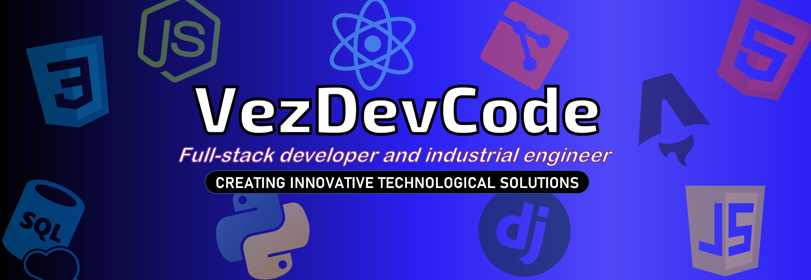

<h1 align="center">Hola, soy Sergio Vez ✌🏼</h1>

Hello! I'm Sergio Vez, a passionate aspiring Full-Stack developer and this is my space where I share my journey in the world of web development.
 

## About this Repository 📁

In this repository, you'll find the source code for my personal website, where I showcase my projects, skills, and my evolution as a developer. My goal is to create innovative web solutions and explore the exciting possibilities of blockchain technology.
 

## Technologies Used 🛠️

 
 
 
 
  
 
 
 
 
 

- Web Development: HTML, CSS, JavaScript
- Backend Technologies: Python, Node.JS, Django
- Front-End Frameworks: React, Astro
- Database: SQL
- Version control: Git

## Relevant Links 🌐

If you're interested in exploring my progress in the world of Full-Stack development and blockchain, I invite you to take a look at some of my most relevant repositories:
 

## Contact Me 📫

If you have questions, suggestions, or just want to chat about web development or blockchain, don't hesitate to get in touch with me through:

 

## GitHub Analytics ⚙️

 

I hope you enjoyed exploring my repository! Thanks for visiting! 👋
